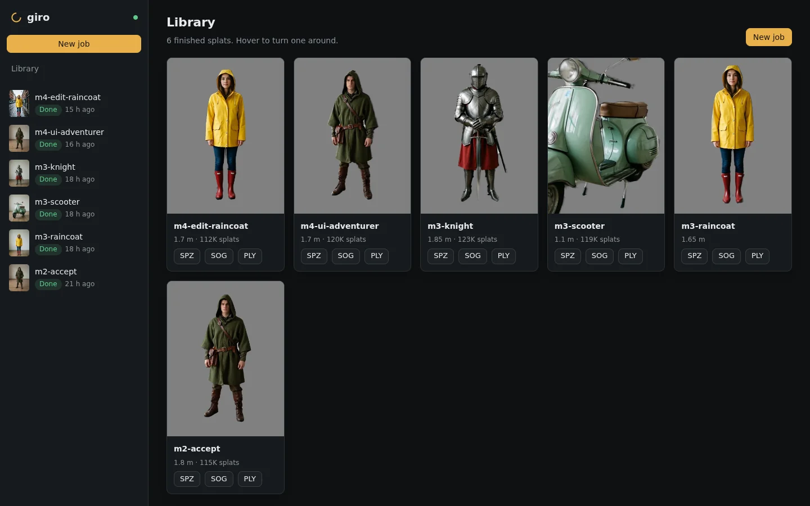
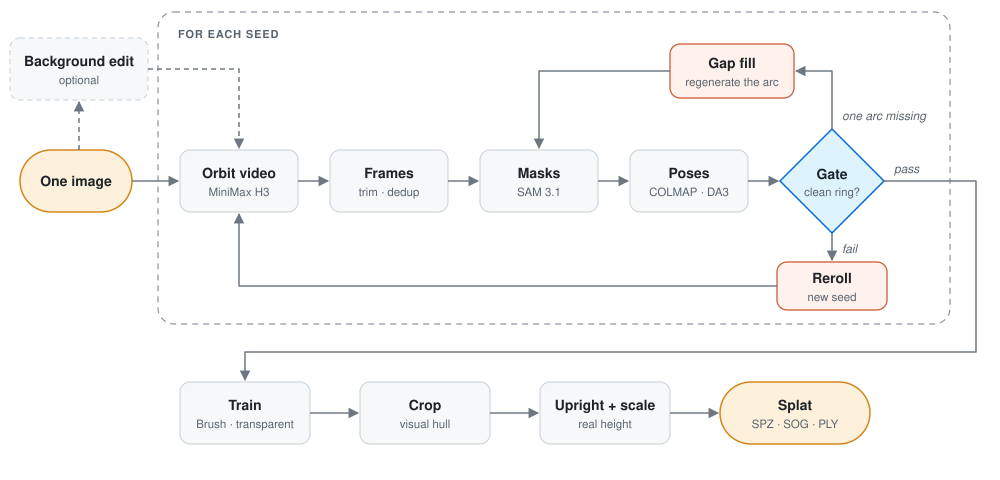
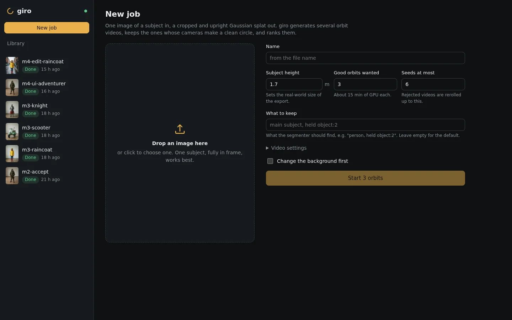
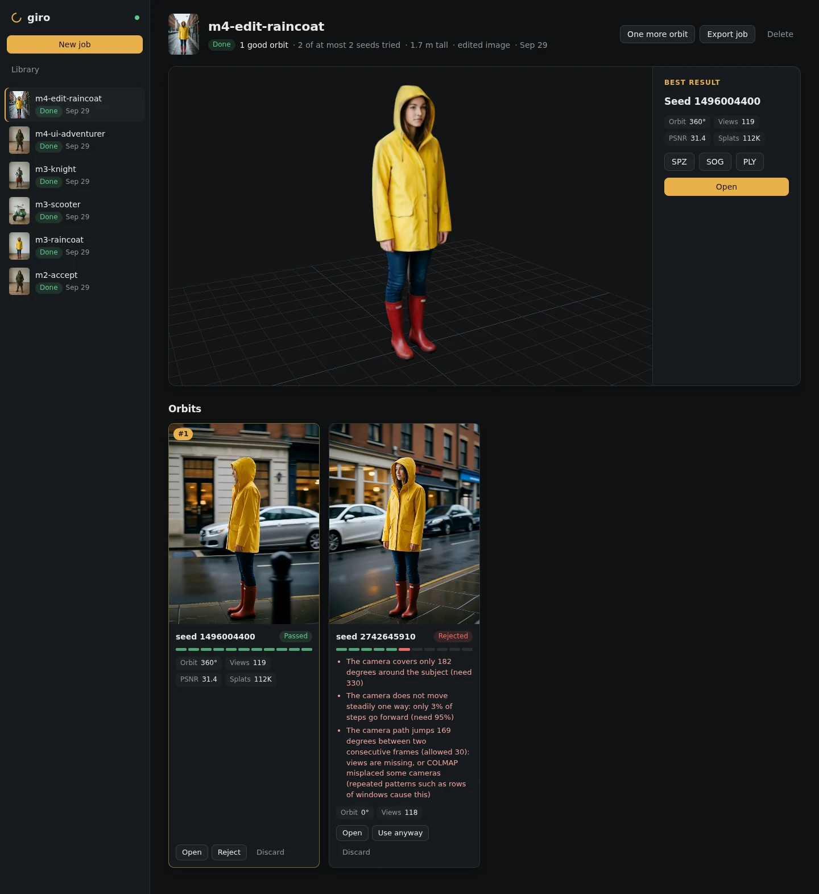
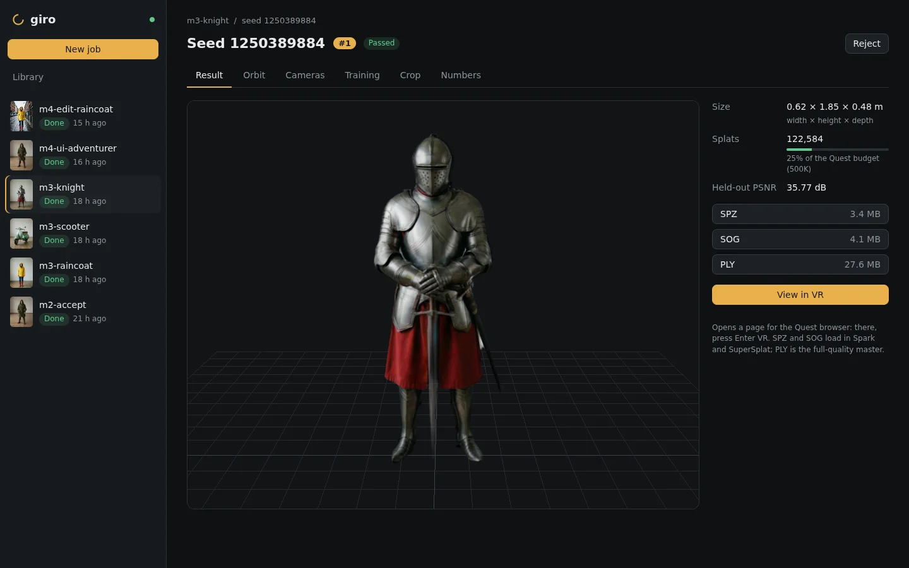
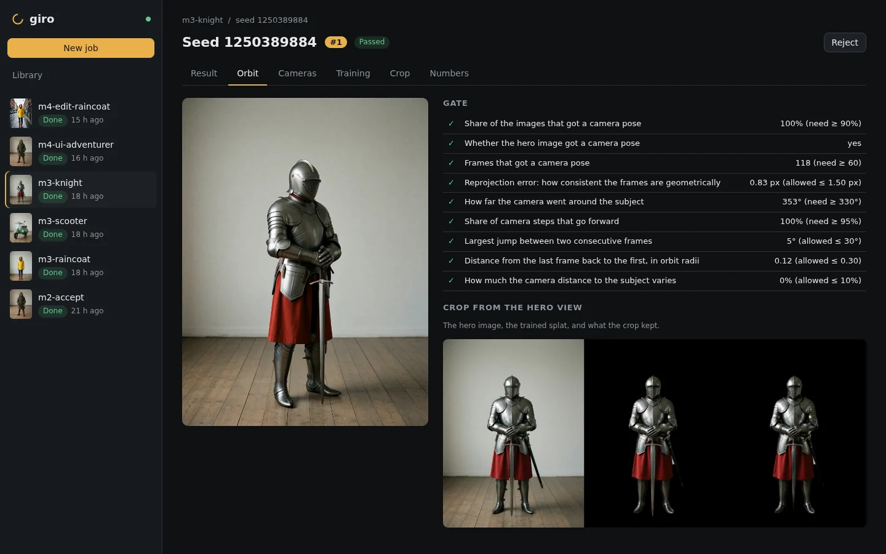
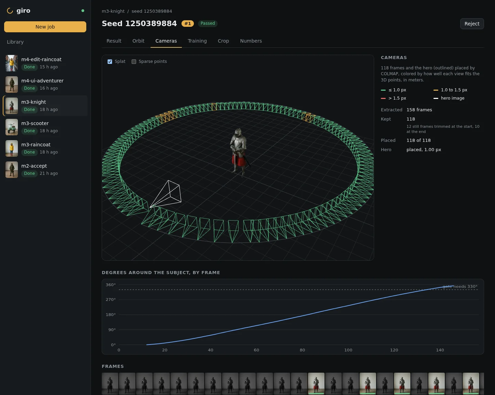
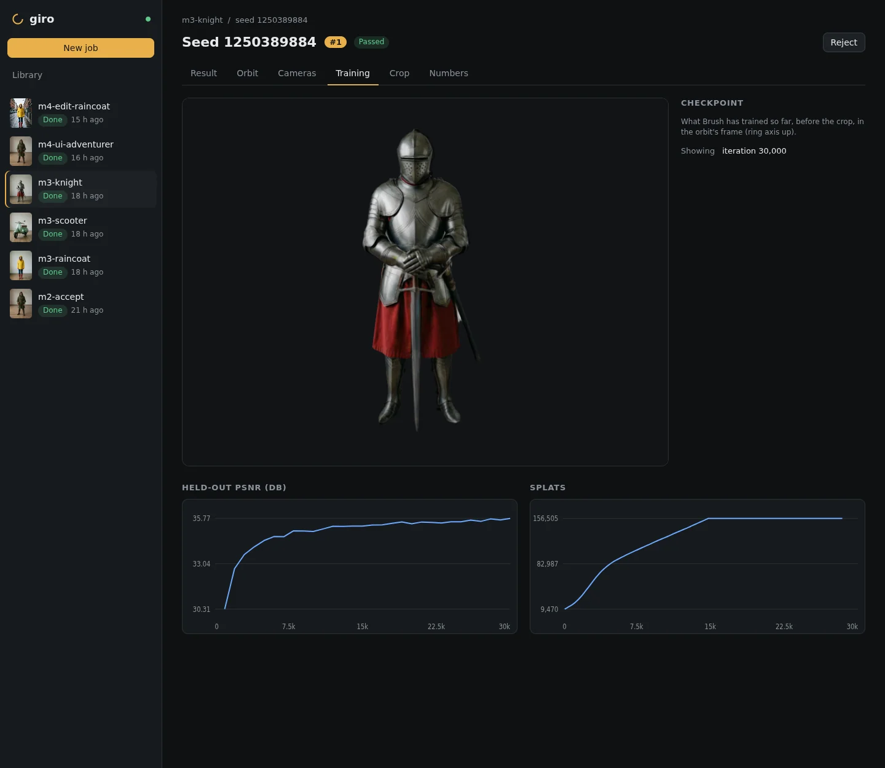
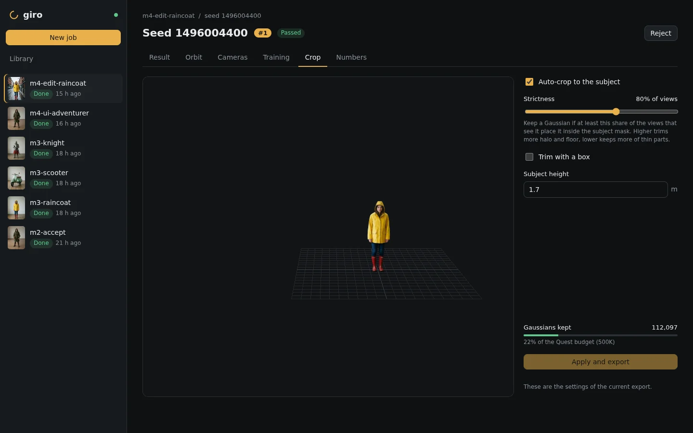
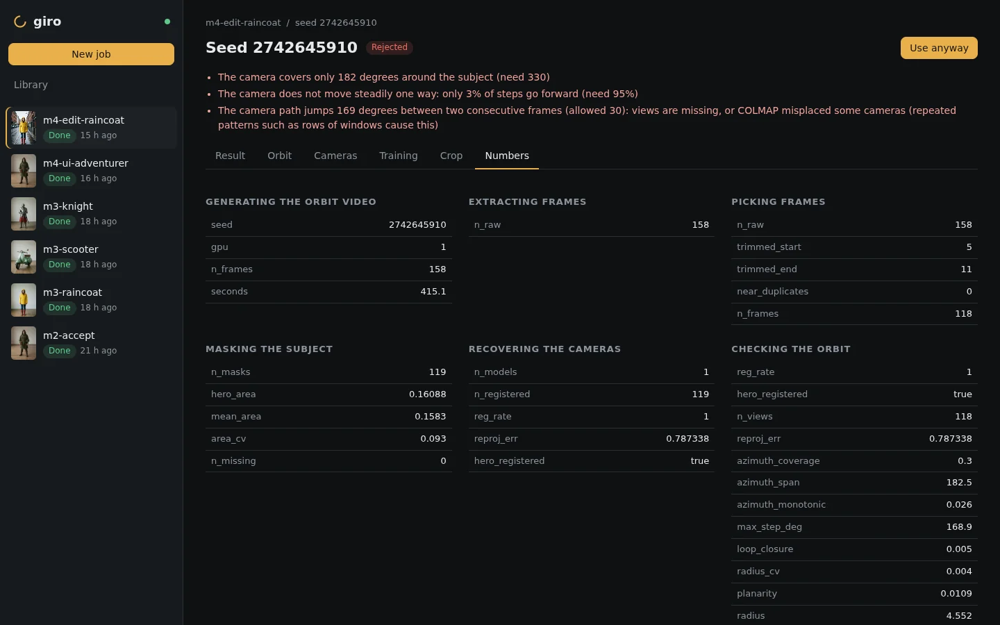

# giro

**One image in, a cropped Gaussian splat you can walk around in VR out.**

> **Experimental research prototype.** A personal learning project, not a product. It runs on one
> machine for one user, needs two 24 GB GPUs, and changes often. The numbers in
> [docs/FINDINGS.md](docs/FINDINGS.md) come from a handful of subjects and seeds: lab notes, not
> benchmarks.

<p align="center"></p>

## The question

Video models can "orbit" a subject from one photo: use the photo as both the first and last frame
and ask for a 360° camera move. The result looks convincing but is hallucinated, and some seeds
cheat. The subject spins like a turntable, the camera swings halfway and morphs back, or frames
jump.

giro asks whether **automated checks can turn these unreliable videos into splats clean enough to
skip manual cleanup**. The manual workflow it replaces: reroll seeds by eye, trim frames, run
COLMAP and a trainer, then delete the room by hand.

## How it works

<!-- regenerate with: uv run scripts/pipeline_diagram.py -->
<picture>
  <source media="(prefers-color-scheme: dark)" srcset="docs/images/pipeline-dark.svg">
  
</picture>

The **gate** is the core idea. It checks the recovered camera ring: at least 330° of sweep,
steady one-way motion, no jump over 30° between frames, a closed loop and a round path. A failing
seed is rerolled. If COLMAP's cameras are what fails, a **pose fallback** poses the frames with
Depth Anything 3 and refines them with COLMAP. If the only problem is one missing arc, **gap fill**
regenerates just that arc.
Passing seeds are ranked by held-out PSNR.

The rest follows from there. Masking the subject before COLMAP rescues "turntable" videos. Brush
trains with a transparent background. The **crop** keeps Gaussians that land inside the subject
mask in most views. The export is upright, scaled to the subject's real height, and compressed for
the web and VR.

## A tour of the UI

`giro serve` runs a local web app. Long steps show live progress, and every decision shows its
reason.

### New job
Drop an image, set the subject's height and the number of good orbits wanted, and optionally
change the background first. Pick the video's shape and size, and drag or zoom the crop frame to
choose which part of the image the orbit starts from.



### Job
The best result on top and one card per seed below. Here one seed passed. The other was rejected
because it covered only 182° and jumped 169° in one step.

**Export job** saves the whole job as one zip to share or archive: an offline HTML report with
each good seed's result, orbit, cameras, training curve and numbers, plus its splat as PLY, SOG
and SPZ.



### Result
The cropped splat with its size, its splat count against the Quest budget, downloads, and a
**View in VR** button for the Quest browser.



### Orbit
Each gate check against its threshold, and the hero view compared across the input image, the
trained splat and the crop.



### Cameras
The recovered camera ring, colored by reprojection error, with the hero camera outlined. A clean
orbit is one smooth ring.



### Training
A live splat preview while Brush trains, with curves for held-out PSNR and splat count.



### Crop
Live crop controls: hull strictness, an optional box and subject height, with the kept count
against the VR budget.



### Numbers
Every metric from every stage. On a rejected seed, the reasons come first and **Use anyway**
overrides the gate.



## What I learned

The details are in [docs/FINDINGS.md](docs/FINDINGS.md).

- The gate matched a visual check on 20 of 20 videos. Its largest-jump check caught one that swept
  357° and still closed its loop.
- Masking out the room rescues turntable videos. One seed went from 4 to 119 of 119 frames placed.
- Gap fill regenerates a missing arc in about 40 s, against 7 minutes for a reroll. It passed in
  3 of 3 tries.
- Feedforward poses (Depth Anything 3, VGGT, MapAnything) trained splats 2–4 dB worse than
  COLMAP's, but as a starting point for COLMAP's refinement they matched it. The pose fallback
  built on this rescued a seed COLMAP left with a 57° jump, in 12 s.
- Transparent training plus the hull crop needed no manual cleanup on the 4 test subjects,
  including their swords and mirrors.
- The Quest 3 browser stuttered at 245K splats, well below the 400–600K I expected. This needs a
  cleaner measurement.

## Running it

giro is shared to read and learn from. It is not packaged for easy installation. You will need:

- Linux with two 24 GB NVIDIA GPUs. The video alone peaks at about 22 GB.
- Python 3.12 with [uv](https://docs.astral.sh/uv/), Node.js, Rust, FFmpeg, and COLMAP 4.x with CUDA.
- The model weights, which you supply (see [Third-party software and models](#third-party-software-and-models)).

```bash
uv sync
scripts/setup_comfy.sh                  # pinned headless ComfyUI in vendor/
scripts/setup_brush.sh                  # pinned Brush
scripts/setup_splat_transform.sh        # pinned splat-transform
scripts/setup_da3.sh                    # optional pose fallback (Depth Anything 3)
# point scripts/extra_model_paths.yaml at your models
cd ui && npm ci && npm run build && cd ..

uv run giro serve                       # UI on http://<host>:8470
uv run giro run image.png -o data/try1  # or one seed from the CLI
uv run giro job export data/jobs/<job>  # a job as one zip: offline HTML report + PLY/SOG/SPZ
```

`just check` lints and runs the tests. Outputs go to `data/`, which git ignores.

## Repository map

| Path | Contents |
|---|---|
| `src/giro/stages/` | One module per pipeline step |
| `src/giro/api.py`, `manager.py`, `job.py`, `scheduler.py` | Orchestrator: API, jobs, rerolls, GPU scheduling |
| `src/giro/comfy/`, `src/giro/workflows/` | Headless ComfyUI client and workflows |
| `ui/` | React UI with a [Spark](https://sparkjs.dev) splat viewer and a WebXR page |
| `scripts/` | Pinned setup scripts, sweeps, report and screenshot helpers |
| `docs/FINDINGS.md` | Lab notes |

## Limitations

- The top of the head, the underside and other unseen parts are invented, and they come out soft.
- The measurements are small: a few subjects and seeds, untuned, on one machine.
- The test images are AI-generated, so held-out PSNR measures consistency with the generated
  video, not with reality.
- There is no authentication. Keep it on your local network.

## Third-party software and models

giro orchestrates the tools below. It ships no weights or third-party binaries. Check each license,
including what it says about outputs, before use.

| Component | Role | License |
|---|---|---|
| [ComfyUI](https://github.com/Comfy-Org/ComfyUI) | Headless inference server (over HTTP) | GPL-3.0 |
| [MiniMax H3](https://huggingface.co/MiniMaxAI/MiniMax-H3) ([ComfyUI files](https://huggingface.co/Comfy-Org/MiniMax-H3)) | Orbit video | [MiniMax H3 Community License](https://huggingface.co/MiniMaxAI/MiniMax-H3/blob/main/LICENSE) |
| [Qwen-Image-Edit-2511](https://huggingface.co/Qwen/Qwen-Image-Edit-2511) ([ComfyUI files](https://huggingface.co/Comfy-Org/Qwen-Image-Edit_ComfyUI), [Lightning LoRA](https://huggingface.co/lightx2v/Qwen-Image-Edit-2511-Lightning)) | Background edit | Apache-2.0 |
| [SAM 3.1](https://huggingface.co/facebook/sam3.1) ([ComfyUI files](https://huggingface.co/Comfy-Org/sam3.1)) | Subject masks | [SAM License](https://huggingface.co/Comfy-Org/sam3.1/blob/main/LICENSE) |
| [COLMAP](https://colmap.github.io) | Camera poses | BSD-3-Clause |
| [Depth Anything 3](https://github.com/ByteDance-Seed/Depth-Anything-3) ([DA3-BASE weights](https://huggingface.co/depth-anything/DA3-BASE)) | Pose fallback | Apache-2.0 |
| [MapAnything](https://github.com/facebookresearch/map-anything) ([weights](https://huggingface.co/facebook/map-anything-apache)) | Pose fallback, tried first (worker kept) | Apache-2.0 |
| [Brush](https://github.com/ArthurBrussee/brush) | Splat training | Apache-2.0 |
| [splat-transform](https://github.com/playcanvas/splat-transform) | SPZ/SOG export | MIT |
| [Spark](https://github.com/sparkjsdev/spark), [three.js](https://threejs.org) | Web and WebXR viewer | MIT |
| [FFmpeg](https://ffmpeg.org) | Frame extraction | LGPL/GPL |

The sample subjects were generated with [Z-Image Turbo](https://huggingface.co/Tongyi-MAI/Z-Image-Turbo)
and [Qwen-Image-2512](https://huggingface.co/Qwen/Qwen-Image-2512) with its
[Lightning LoRA](https://huggingface.co/lightx2v/Qwen-Image-2512-Lightning), all Apache-2.0.
[Spirula Studio](https://github.com/harry7557558/spirula-studio) was tried along the way (see
[FINDINGS](docs/FINDINGS.md#camera-poses)). Gap fill adapts an idea from OrbitForge
([arXiv:2606.24799](https://arxiv.org/abs/2606.24799)).

## License

giro's own code is [MIT](LICENSE). The license does not cover the third-party tools and models above.
